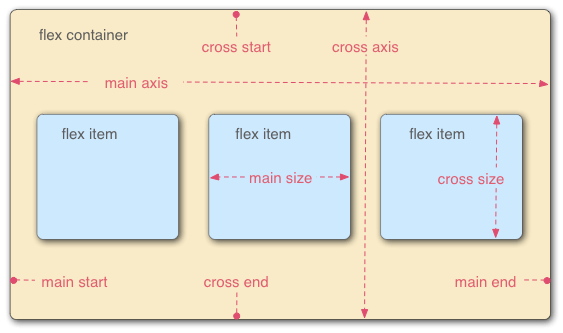

[TOC]

# Layout

> 阮一峰《[Flex 布局教程：语法篇](https://www.ruanyifeng.com/blog/2015/07/flex-grammar.html)》《[Flex 布局教程：实例篇](https://www.ruanyifeng.com/blog/2015/07/flex-examples.html)》《[CSS Grid 网格布局教程](https://www.ruanyifeng.com/blog/2019/03/grid-layout-tutorial.html)》

## 概述

布局的传统解决方案，基于**盒状模型**，创建工具有 [Floats](https://developer.mozilla.org/zh-CN/docs/Learn/CSS/CSS_layout/Floats)（浮动布局）和 [Positioning](https://developer.mozilla.org/zh-CN/docs/Learn/CSS/CSS_layout/Positioning)（定位布局），依赖 `display` 属性 + `position`属性 + `float` 属性。这两个工具的局限性：

- 在父内容里面垂直居中一个块内容。
- 使容器的所有子项占用等量的可用宽度/高度，而不管有多少宽度/高度可用。
- 使多列布局中的所有列采用相同的高度，即使它们包含的内容量不同。

Flex（Flexible Box，弹性盒子、弹性布局）是一种基于<u>行或列轴线</u>布局元素的**一维布局**模型（一次只能处理一行或一列上的布局）。元素可以膨胀以填充额外的空间，收缩以适应更小的空间。它为盒状模型提供了最大的灵活性。

Grid（网格布局）是一种基于<u>网格内单元格</u>布局元素的**二维布局**系统（可以同时处理行和列上的布局）。它将网页划分成一个个网格，可以任意组合不同的网格，做出各种各样的布局。

Grid 布局与 Flex 布局有一定的相似性，都可以指定“容器”内部多个“项目”的位置。但 Grid 布局远比 Flex 布局强大。

## Flex



### 基本概念

#### ==容器==（flex container）

##### 区块容器：`display: flex;`

##### 行内容器：`display: inline-flex;`

#### ==项目==（flex item）

“容器”的所有子元素会自动成为它的“项目”。

### 内置属性

#### 容器的属性

##### ~~主轴方向~~：`flex-direction: row | row-reverse | column | column-reverse;`

##### ~~轴线换行~~：`flex-wrap: nowrap | wrap | wrap-reverse;`

##### *合并简写*：`flex-flow: <flex-direction> || <flex-wrap>;`

##### ==主轴对齐==：`justify-content: flex-start | flex-end | center | space-between | space-around;`


##### ==纵轴对齐==：`align-items: stretch | flex-start | flex-end | center | baseline;`


##### 多轴对齐：`align-content: stretch | flex-start | flex-end | center | space-between | space-around;`


#### 项目的属性

##### 排序编号：`order: <integer>; /* default 0 */`

##### ~~放大比例~~：`flex-grow: <number>; /* default 0 */`

##### ~~缩小比例~~：`flex-shrink: <number>; /* default 1, note 0 = noshrink */`

##### ~~基本空间~~：`flex-basis: <length> | auto; /* default auto = initial main size */`

##### *合并简写*：`flex: none | [ <'flex-grow'> <'flex-shrink'>? || <'flex-basis'> ]; /* none = 0 0 auto, auto = 1 1 auto */`[^1]

##### ==定制位置==：`align-self: auto | flex-start | flex-end | center | baseline | stretch;`

## Grid


#### ==容器==（grid container）

##### 区块容器：`display: grid;`

##### 行内容器：`display: inline-grid;`

#### ==项目==（grid item）

“容器”的所有*顶层*子元素会自动成为它的“项目”，不包含项目的子元素。

### 内置属性

#### 容器的属性

##### ~~行高列宽~~：`grid-template-rows`, `grid-template-columns`:

```css
.container {
  grid-template-rows: 100px 100px 100px;
  grid-template-columns: 100px 100px 100px;
}
.container {
  grid-template-columns: 33.33% 33.33% 33.33%;
}
.container {
  grid-template-columns: repeat(3, 33.33%); // 重复列宽方式多少列数的函数
}
.container {
  grid-template-columns: repeat(auto-fill, 100px); // 自动填充列数
}
.container {
  grid-template-columns: 1fr 2fr; // fraction 后者是前者的两倍
}
.container {
  grid-template-columns: 1fr 1fr minmax(100px, 1fr); // 长度范围的最小值和最大值
}
.container {
  grid-template-columns: 100px auto 100px; // 自动设置宽度
}
.container {
  grid-template-columns: [c1] 100px [c2] 100px [c3] auto [c4]; // 网格线的名称
}
```

##### ~~区域命名~~：`grid-template-areas`:

```css
.container {
  grid-template-areas: 'a a a'
    'b b b'
    'c c c';
}
.container {
  grid-template-areas: "header header header"
    "sidebar main sidebar"
    "footer footer footer";
}
.container {
  grid-template-areas: 'a . c'
    'd . f'
    'g . i';
}
```

##### *合并简写*：`grid-template: <grid-template-rows> <grid-template-columns> || <grid-template-areas>;`

##### ~~自动网格~~：`grid-auto-rows`, `grid-auto-columns`

##### ~~自动排序~~：`grid-auto-flow: row | column | row dense | column dense;`

##### *合并简写*：`grid: [<grid-template-rows> <grid-template-columns> || <grid-template-areas>] <grid-auto-rows> <grid-auto-columns> <grid-auto-flow>;`

##### 沟槽间隔：~~`grid-row-gap`, `grid-column-gap`, `grid-gap`,~~ `gap: <row-gap> <column-gap>?;`[^1]

##### ==器内对齐==：

###### 水平对齐：`justify-content: start | end | center | stretch | space-around | space-between | space-evenly;`

- `start`:


- `end`:


- `center`:


- `stretch`:


- `space-around`:


- `space-between`:


- `space-evenly`:


###### 垂直对齐：`align-content: start | end | center | stretch | space-around | space-between | space-evenly;`

###### *合并简写*：`place-content: <align-content> <justify-content>?;`

##### ==格内对齐==：

###### 水平边线：`justify-items: stretch | start | end | center;`

- `start`:


###### 垂直边线：`align-items: stretch | start | end | center;`

- `start`:


###### *合并简写*：`place-items: <align-items> <justify-items>;`[^1]

#### 项目的属性

##### ~~边线对齐~~：`grid-row-start`, `grid-row-end`, `grid-column-start`, `grid-column-end`

##### *合并简写*：`grid-row: <start-line> / <end-line>;`, `grid-column: <start-line> / <end-line>;`

##### ==区域位置==：`grid-area`

##### ==定制位置==：

###### 水平位置：`justify-self: stretch | start | end | center; /* see justify-items */`

###### 垂直位置：`align-self: stretch | start | end | center; /* see align-items */`

###### *合并简写*：`place-self: <align-self> <justify-self>?; /* see place-items */`[^1]

[^1]: 如果省略第二个值，则浏览器认为与第一个值相等。
